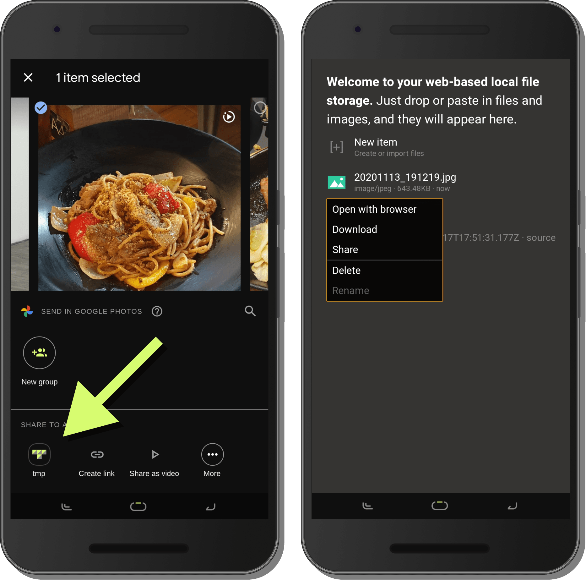

# Built-in functionalities

## Putting files in

### Select files from your device

**New item** &rarr; **Select files from your device** opens up your system file picker. You can select multiple files.

### Drop in files

You can **drop files from your system file manager** into the `tmp.spacet.me` window. The dropped files will be added to the storage.

### Paste in images

If your clipboard holds an image, you can press **Ctrl+V** or **Cmd+V** to paste in the image as a PNG file.

### Share from other apps

_(This feature is only available in Google Chrome on Android.)_

If you installed the app, you can share files and images from other apps into `tmp.spacet.me`.

## Getting files out

### Drag out files

_(This feature is only available in Google Chrome.)_

You can **drag out files from `tmp.spacet.me`** into your system file manager.

