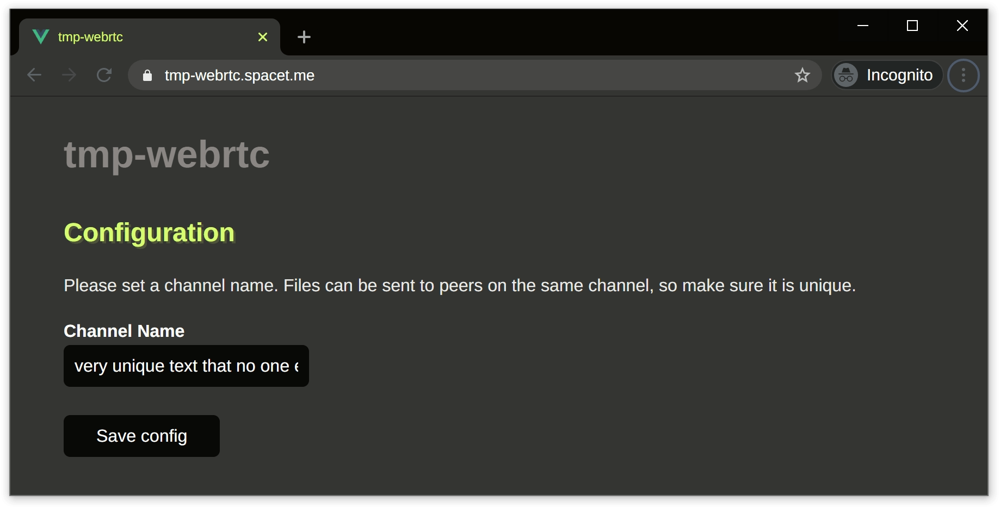
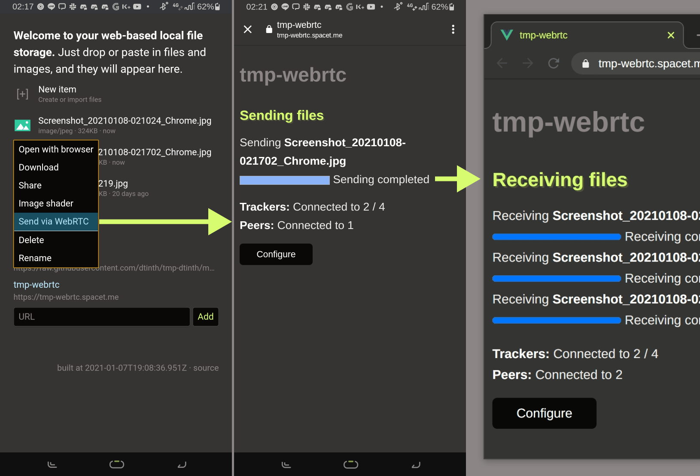
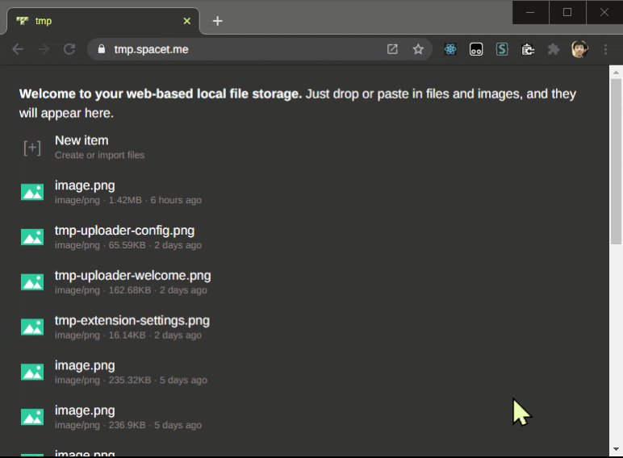

# tmp-webrtc extension

The **tmp-webrtc** extension lets you transfer files between devices using a peer-to-peer technology, [WebRTC](https://webrtc.org/).

## Channel settings

On first use, `tmp-webrtc` must be configured with a unique **channel name**. Devices having the same channel name will be able to discover each other.

## Send via WebRTC

Selecting **Send via WebRTC** will open a sender window. While the sender window is still open, it will transfer the file to every receiver on the same channel.

## Receive via WebRTC

In the **New item** menu, selecting **Receive via WebRTC** will open a receiver window. It will receive files from any sender on the same channel. That means you can receive multiple files.

